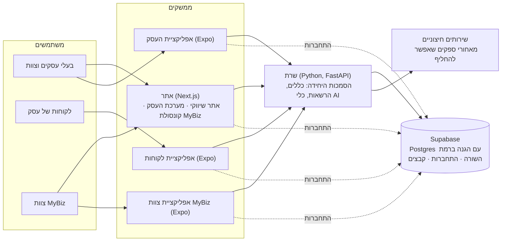

# מפת התיעוד של MyBiz

מדריך קצר: איפה כל דבר נמצא, איך המערכת בנויה, ובאילו שירותים חיצוניים היא משתמשת היום ובהמשך. ([English](README.md))

## איפה המסמכים

| מה | איפה | מתי לקרוא |
|---|---|---|
| אפיון המוצר (המקור הקובע) | [`spec/v3/spec.he.md`](spec/v3/spec.he.md) · [English](spec/v3/spec.en.md) | מה זה MyBiz, המסכים, התפקידים, התחומים, המודולים ומפת הדרכים |
| האפיון כקובצי Word | [`spec/MyBiz-Spec-he.docx`](spec/MyBiz-Spec-he.docx) · [`spec/MyBiz-Spec-en.docx`](spec/MyBiz-Spec-en.docx) | נוצרים מ-v3 עם `node scripts/spec-to-docx.cjs he\|en` |
| פרקי תכנון מפורטים (v2) | [`spec/v2/`](spec/v2/README.md) | ארכיטקטורה, מודל נתונים, AI וכללי תמחור לעומק |
| החזון המקורי (v1) | [`spec/v1/`](spec/v1/) | האפיון הראשון שלך, נשמר לתיעוד |
| החלטות | [`DECISIONS.md`](DECISIONS.md) | למה משהו בנוי כמו שהוא (לכל החלטה יש מזהה, למשל X13) |
| לוח הסטטוס | [`STATUS.he.md`](STATUS.he.md) · [English](STATUS.md) | מה הושלם, מה בעבודה, מה הבא, ומה מחכה לך |
| הצעות לפיצ'רים | [`proposals/`](proposals/) | התכנון של פיצ'ר גדול לפני שנבנה (#41–#45, חיבורים) |
| סקירות | [`reviews/`](reviews/) | סקירות ארכיטקטורה ואבטחה והמשך הטיפול בהן |
| תחומים | [`verticals.md`](verticals.md) | קטלוג הקטגוריות ואיך מוסיפים קטגוריה |
| מערכת העיצוב | [`design-system.md`](design-system.md) | גופנים, צבעים, כפתורים, טקסטים ומחירים: איפה משנים מה |
| שירותים חיצוניים | [`integrations.md`](integrations.md) | איך מוסיפים או מחליפים ספק (סליקה, חשבוניות, הודעות…) |
| אתר הבדיקות | [`deploy/staging.md`](deploy/staging.md) | איפה אתר הבדיקות רץ, הסודות שלו וההגדרה הראשונית |

## איך המערכת בנויה

- **מאגר קוד אחד** (pnpm workspaces ו-Turborepo): חמש אפליקציות וארבע חבילות משותפות.

  | נתיב | מה |
  |---|---|
  | `apps/web` | ‏Next.js: האתר השיווקי ומסע ההרשמה, מערכת העסק (CRM), קונסולת MyBiz |
  | `apps/api` | ‏FastAPI: כל נקודות הקצה (`app/api/`), הלוגיקה מקובצת לפי תחום (`app/schedule`, `commerce`, `messaging`, `catalog`, `reports`), מיגרציות של מסד הנתונים (Alembic), משימות רקע, עוזר ה-AI, בדיקות |
  | `apps/client-app` | אפליקציית הלקוחות (Expo, רצה גם בדפדפן) |
  | `apps/business-app` | אפליקציית העסק לבעלים ולצוות בדרכים (Expo) |
  | `apps/staff-app` | אפליקציית צוות MyBiz ‏(Expo) |
  | `packages/app-kit` | מה ששלוש אפליקציות ה-Expo חולקות: מסכים, רכיבים, התחברות, ערכת צבעים |
  | `packages/i18n` | הטקסטים בעברית ובאנגלית, ועיצוב סכומים ותאריכים |
  | `packages/verticals` | קטלוג התחומים (קטגוריות ← תתי־קטגוריות ← חבילות) |
  | `packages/api-client` | לקוח ה-API עם טיפוסים, שנוצר מהסכמה של השרת |

- **השרת הוא הסמכות.** האתר והאפליקציות רק מציגים ושואלים; כל הכללים נמצאים בשרת. עוזר ה-AI פועל רק דרך כלים מאושרים, ופעולות רגישות מחכות לאישור של אדם.
- **כל עסק מבודד פעמיים:** בכל שורה יש מזהה עסק, השרת בודק אותו, וההגנה ברמת השורה של Postgres אוכפת אותו שוב.
- **ליבה אחת לכל התחומים.** מה ששונה בין תחומים (מילים, שירותים ברירת מחדל, פרטי לקוח) הוא הגדרות ב-`packages/verticals`, לא קוד נפרד.
- **כל שירות חיצוני יושב מאחורי ממשק** (`apps/api/app/providers/`). ספק חדש הוא מחלקה אחת, וכל עסק בוחר בהגדרות שלו את ספק הסליקה, החשבוניות וההודעות.
- **בקרת איכות:** ה-CI מריץ בדיקות קוד, בדיקות טיפוסים, בדיקות שרת ובנייה על כל PR; בדיקות דפדפן מקצה לקצה נמצאות ב-`e2e/`.

## איפה זה רץ (אתר הבדיקות)

| חלק | שירות | נפרס מתוך |
|---|---|---|
| אתר | ‏Vercel (פרנקפורט) | ‏`main`, נפרס דרך GitHub Actions |
| שרת | ‏Render (פרנקפורט, תוכנית חינמית: נרדם אחרי 15 דקות בלי תנועה) | ‏`main` |
| מסד נתונים, התחברות, קבצים | ‏Supabase (פרנקפורט) | המיגרציות רצות בכל עליית שרת ומ-GitHub Actions |
| עבודות מתוזמנות | ‏GitHub Actions | משימות רקע, מיילי התראות, נתוני הדגמה, מיגרציות |
| קוד, משימות, CI | ‏GitHub ‏(`MyBiz-app/business-os`) | — |

## שירותים חיצוניים: היום ובעלייה לאוויר

| יכולת | היום | בעלייה לאוויר (מועמדים) |
|---|---|---|
| סליקת אשראי | כרטיס בדיקה מדומה (מסכים ותהליכים אמיתיים) | ספק סליקה ישראלי: Cardcom, ‏Grow, ‏PayPlus או Tranzila (החלטה #46); איתו מגיעים Apple Pay ו-Google Pay |
| חשבוניות וקבלות | קבלות ממוספרות של MyBiz | ספק חשבוניות: Morning (חשבונית ירוקה), ‏iCount או EZcount (החלטה #47) |
| עוזר AI | תשובות הדגמה מתוך הנתונים האמיתיים | ‏Claude API ‏(Anthropic) עם מפתח לייצור (#50) |
| מייל | ביומן בלבד במחשב; ‏SMTP (Gmail) או Resend זמינים | ספק מייל טרנזקציוני על הדומיין שלנו (#48) |
| וואטסאפ ו-SMS | נרשם ולא נשלח; קישורי wa.me חינמיים | ‏WhatsApp Business API ושער SMS ‏(#49) |
| אחסון קבצים | בתוך מסד הנתונים | ‏Supabase Storage או אחסון קבצים אחר |
| חנויות אפליקציות | עוד לא | בניות ל-App Store ול-Google Play ‏(Expo EAS) |
| התחברות עם Google / Apple | נבנה; מחכה שתפעיל את הספקים ב-Supabase | — |

החלפה של כל אחד מאלה היא בחירת ספק, לא כתיבה מחדש: ראה [`integrations.md`](integrations.md).

