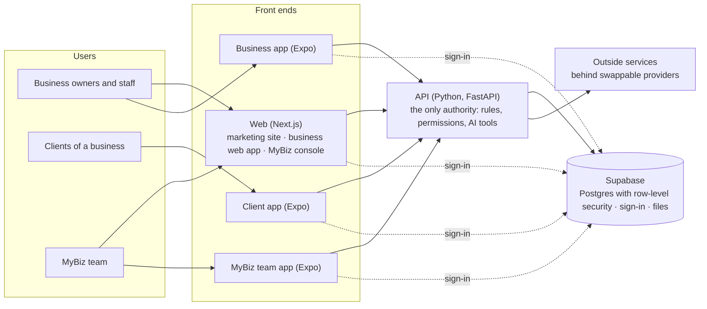

# MyBiz documentation map

A short guide to where things are, how the system is built, and which outside services it
uses today and later. ([עברית](README.he.md))

## Where the documents are

| What | Where | When to read it |
|---|---|---|
| Product spec (source of truth) | [`spec/v3/spec.en.md`](spec/v3/spec.en.md) · [עברית](spec/v3/spec.he.md) | What MyBiz is, its surfaces, roles, industries, modules, roadmap |
| Spec as Word files | [`spec/MyBiz-Spec-en.docx`](spec/MyBiz-Spec-en.docx) · [`spec/MyBiz-Spec-he.docx`](spec/MyBiz-Spec-he.docx) | Generated from v3 with `node scripts/spec-to-docx.cjs he\|en` |
| Detailed design chapters (v2) | [`spec/v2/`](spec/v2/README.md) | Architecture, data model, AI, pricing rules in depth |
| The original vision (v1) | [`spec/v1/`](spec/v1/) | The owner's first spec, kept for history |
| Decisions | [`DECISIONS.md`](DECISIONS.md) | Why something is the way it is (every decision has an id, e.g. X13) |
| Status board | [`STATUS.md`](STATUS.md) · [עברית](STATUS.he.md) | What is done, in progress and next; what the owner needs to do |
| Feature proposals | [`proposals/`](proposals/) | The design of a big feature before it was built (#41–#45, integrations) |
| Reviews | [`reviews/`](reviews/) | Architecture and security reviews and their follow-ups |
| Industries | [`verticals.md`](verticals.md) | The category catalog and how to add a category |
| Design system | [`design-system.md`](design-system.md) | Fonts, colors, buttons, texts, prices: where to change what |
| Outside services | [`integrations.md`](integrations.md) | How to add or switch a provider (payments, invoices, messages…) |
| Staging | [`deploy/staging.md`](deploy/staging.md) | Where the test site runs, its secrets and one-time setup |

## How the system is built

- **One monorepo** (pnpm workspaces + Turborepo): five apps and four shared packages.

  | Path | What |
  |---|---|
  | `apps/web` | Next.js: the marketing site and sign-up journey, the business web app (CRM), the MyBiz console |
  | `apps/api` | FastAPI: every endpoint, database migrations (Alembic), background jobs, the AI assistant, tests |
  | `apps/mobile` | The clients' app (Expo, also runs in the browser) |
  | `apps/business-app` | The business app for owners and staff on the go (Expo) |
  | `apps/staff-app` | The MyBiz team app (Expo) |
  | `packages/app-kit` | What the three Expo apps share: screens, components, session, theme |
  | `packages/i18n` | Hebrew and English texts, and money and date formatting |
  | `packages/verticals` | The industry catalog (categories → sub-categories → packs) |
  | `packages/api-client` | The typed API client, generated from the API's schema |

- **The backend is the authority.** The web and the apps only show and ask; every rule lives in
  the API. The AI assistant acts only through approved tools, and sensitive actions wait for a
  person's approval.
- **Each business is isolated twice:** every row carries its business id, and the API checks it
  and Postgres row-level security enforces it again.
- **One core for every industry.** What differs between industries (words, default services,
  client details) is configuration in `packages/verticals`, not separate code.
- **Every outside service sits behind an interface** (`apps/api/app/providers/`). A new vendor is
  one class; each business chooses its own payments, invoicing and messaging provider in its
  settings.
- **Quality gates:** CI runs lint, type checks, API tests and a build on every pull request;
  end-to-end browser checks live in `e2e/`.

## Where it runs (staging)

| Part | Service | Deploys from |
|---|---|---|
| Web | Vercel (Frankfurt) | `main`, deployed by GitHub Actions |
| API | Render (Frankfurt, free plan: sleeps after 15 minutes idle) | `main` |
| Database, sign-in, files | Supabase (Frankfurt) | migrations run on every API start and from GitHub Actions |
| Scheduled work | GitHub Actions | background jobs, notification emails, demo data, migrations |
| Code, issues, CI | GitHub (`MyBiz-app/business-os`) | — |

## Outside services: today and at go-live

| Capability | Today | At go-live (candidates) |
|---|---|---|
| Card payments | Simulated test card (real screens and flows) | An Israeli payment provider: Cardcom, Grow, PayPlus or Tranzila (decision #46); Apple Pay and Google Pay come with it |
| Invoices and receipts | MyBiz's own numbered receipts | An invoicing provider: Morning (Green Invoice), iCount or EZcount (decision #47) |
| AI assistant | Demo answers from real data | Claude API (Anthropic) with a production key (#50) |
| Email | Log only locally; SMTP (Gmail) or Resend available | A transactional email provider on our own domain (#48) |
| WhatsApp and SMS | Logged, not sent; free wa.me links | WhatsApp Business API and an SMS gateway (#49) |
| File storage | Inside the database | Supabase Storage or another object store |
| App stores | Not yet | Apple App Store and Google Play builds (Expo EAS) |
| Sign-in with Google / Apple | Built; waits for the providers to be turned on in Supabase | — |

Switching any of these is a provider choice, not a rewrite: see [`integrations.md`](integrations.md).
