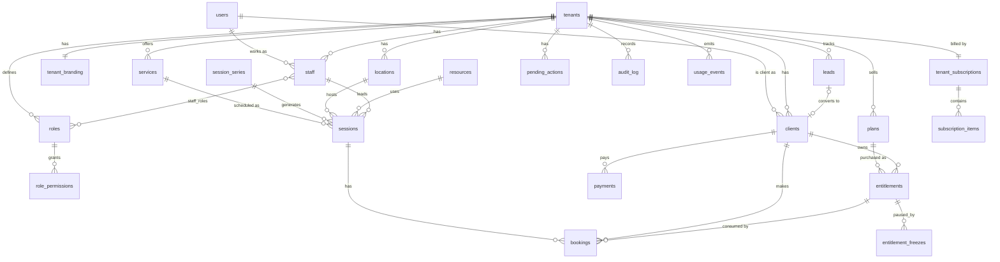

# 05 — Data Model (draft)

## Conventions

- Primary keys: UUID v7 (`id`).
- Tenant-scoped tables have `tenant_id uuid not null` + RLS policy.
- Timestamps: `created_at`, `updated_at` (`timestamptz`, UTC). Soft delete via `deleted_at` where
  history matters.
- Money: `amount_minor bigint` + `currency char(3)`.
- Tenant-entered translatable text: `jsonb` like `{"he": "...", "en": "..."}`.
- Enums as Postgres `text` + check constraint (easier to evolve than native enums).
- Table names plural, snake_case.

## ERD (core)

## Entities

### Identity & tenancy
| Table | Key columns |
|---|---|
| `users` | `auth_user_id` (Supabase), `email`, `phone`, `full_name`, `locale`, `appearance` |
| `tenants` | `slug`, `name`, `vertical_key`, `country_code`, `default_locale`, `currency`, `time_zone`, `status` (trial/active/suspended/cancelled) |
| `tenant_branding` | `logo_url`, `primary_color`, `secondary_color`, `accent_color`, `cover_image_url`, `description` (i18n) |
| `locations` | `name`, `address`, `time_zone` |
| `staff` | `user_id`, `display_name`, `title`, `status` |
| `roles` / `role_permissions` / `staff_roles` | role name (i18n), `is_system`, permission keys |
| `clients` | `user_id` (nullable), `first_name`, `last_name`, `email`, `phone`, `birth_date`, `source`, `status`, `custom_fields` (jsonb), `marketing_consent` |
| `client_forms` | `form_key` (e.g. health_declaration), `payload`, `signed_at`, `signature_url` |

### Catalog & scheduling
| Table | Key columns |
|---|---|
| `services` | `name` (i18n), `kind` (appointment/class), `duration_minutes`, `default_capacity`, `color`, `is_active` |
| `resources` | `name`, `kind` (room/chair/equipment), `location_id` |
| `session_series` | recurrence (`rrule`), defaults for generated sessions |
| `sessions` | `service_id`, `location_id`, `resource_id`, `staff_id`, `starts_at`, `ends_at`, `capacity`, `status` |
| `staff_availability` | weekly hours + exceptions (for appointment businesses) |
| `bookings` | `session_id`, `client_id`, `entitlement_id`, `status` (booked/waitlisted/cancelled/attended/no_show), `waitlist_position`, `channel` (app/staff/ai) |

### Commerce (business → client)
| Table | Key columns |
|---|---|
| `plans` | `name` (i18n), `type` (recurring/punch_card/single/package), `price_minor`, `billing_period`, `credits`, `validity_days`, `rules` (jsonb) |
| `entitlements` | `client_id`, `plan_id`, `starts_at`, `ends_at`, `credits_remaining`, `status` (active/frozen/expired/cancelled) |
| `entitlement_freezes` | `starts_on`, `ends_on`, `reason` |
| `payments` | `client_id`, `amount_minor`, `currency`, `status`, `provider`, `provider_ref`, `idempotency_key` (unique) |

### CRM
| Table | Key columns |
|---|---|
| `leads` | `source`, `campaign`, `stage` (new/contacted/trial/offer/won/lost), `client_id`, `owner_staff_id` |
| `lead_activities` | `kind`, `note`, `occurred_at` |

### AI, audit, usage
| Table | Key columns |
|---|---|
| `ai_conversations` / `ai_messages` | `user_id`, `agent_key`, `role`, `content`, `model`, `tokens_in/out` |
| `pending_actions` | `requested_by_user_id`, `agent_key`, `tool_name`, `payload` (jsonb), `payload_hash`, `risk_level`, `status` (pending/approved/rejected/expired/executed/failed), `expires_at`, `approved_by`, `executed_at`, `result` |
| `audit_log` | `actor_type` (user/ai/system/platform), `actor_id`, `action`, `entity_type`, `entity_id`, `before`, `after`, `occurred_at` |
| `usage_events` | `meter`, `quantity`, `occurred_at`, `source_ref` — rolled up daily |

### Platform billing (us → business)
| Table | Key columns |
|---|---|
| `modules` | `key`, `name` (i18n), `dependencies` |
| `price_versions` / `prices` | versioned price book per module, tier and currency |
| `tenant_subscriptions` | `price_version_id`, `billing_period`, `status`, `current_period_end` |
| `subscription_items` | `module_key`, `tier`, `quantity`, `unit_price_minor`, `effective_from`, `effective_to` |

## Invariants to test

- No query returns rows of another tenant.
- `bookings` with status booked/attended never exceed `sessions.capacity`.
- A payment with the same `idempotency_key` is created once.
- A frozen entitlement cannot be used for booking; freeze extends `ends_at`.
- Pending actions execute only once, only if `payload_hash` matches, before `expires_at`, and only
  if the approver still holds the required permission.
